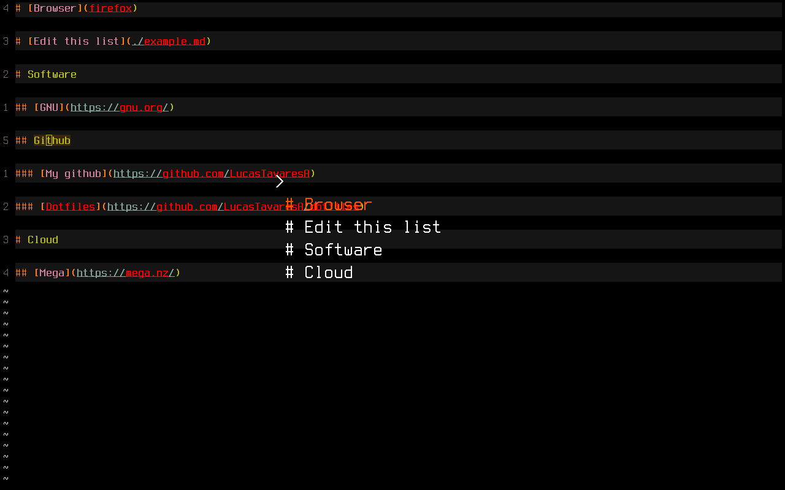

# orgmenu

Easily navigate through nested headers in orgmode/markdown files using a menu program

After an item is selected it guesses if its a file to edit, execute or a link
to open in the browser

## Usage

`orgmenu example.md`
